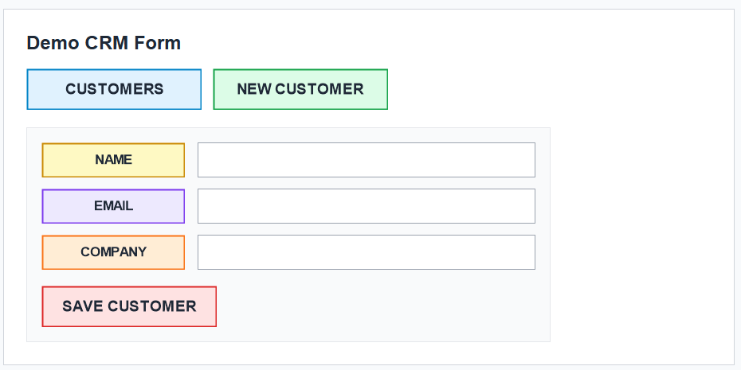
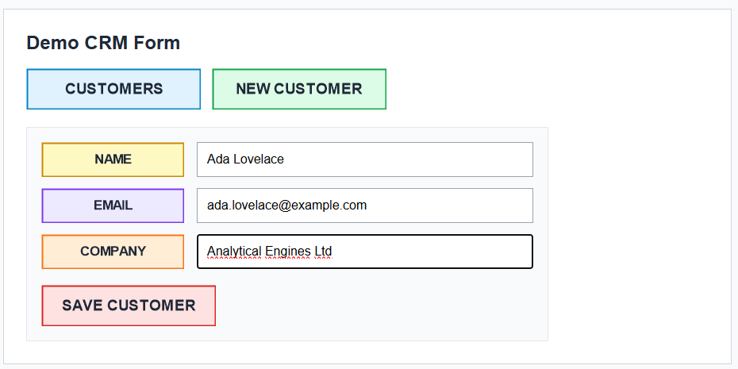
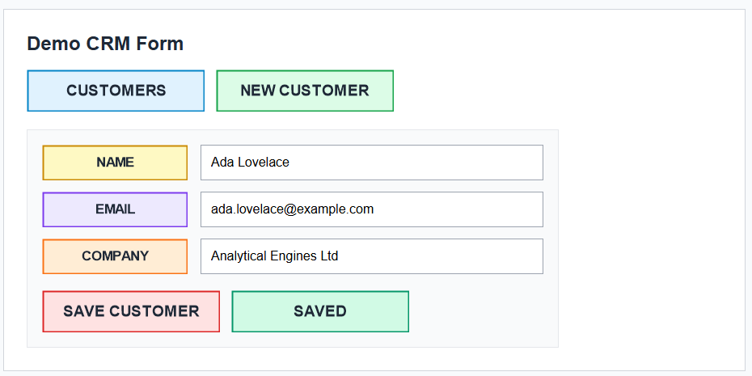

# Visual Template Automation Toolkit

[Prefers to read in Portuguese? Click here.](README-pt-br.md)

A Python toolkit for building desktop automations based on visual templates.

Python | OpenCV | PyAutoGUI | Flet | Desktop Automation | Computer Vision

The project provides a reusable computer-vision core, a Flet interface for managing template images, and a CSV/JSON-driven flow runner. It is intentionally generic: the target application, templates, and workflows are supplied by the user.

This repository is a public portfolio/demo version. It does not include proprietary templates, production workflows, internal system names, credentials, or real business data.

## What It Does

- Locates visual templates on screen with OpenCV.
- Tries multiple template scales to tolerate UI size and display-scaling differences.
- Clicks, double-clicks, waits for, and fills fields based on template matches.
- Manages template images through a lightweight Flet UI.
- Captures new templates from the screen.
- Runs declarative JSON flows against CSV rows.
- Saves failure screenshots to help debug broken automations.

## Platform Notes

This project is designed primarily for Windows desktop automation.

It uses PyAutoGUI to control the mouse and keyboard. When running the UI tests or flow runner, keep the target window visible and avoid using the computer until the automation finishes.

PyAutoGUI's failsafe is enabled in `core.py`: move the mouse to a screen corner to interrupt automation in an emergency.

## Quick Start

```powershell
python -m venv .venv
.\.venv\Scripts\activate
pip install -r requirements.txt
python main.py
```

## Included Demo

This repository includes a small fake CRM form and ready-to-use demo templates, so the project is not empty after cloning.

- `examples/demo_target.html`: browser-based fake CRM form.
- `assets/images/demo_*.png`: templates that match the demo page.
- `examples/demo_items.csv`: fake spreadsheet rows used by the batch demo.
- `examples/demo_customers.csv`: fake customer records for the form automation demo.
- `flows/demo_customer_form.json`: declarative visual flow that fills the form.

To try the visual flow manually:

1. Run `python main.py`.
2. In the UI, go to `Flows`.
3. Click `Open demo target`.
4. Keep the browser visible at 100% zoom.
5. Click `Run flow`.

The app should fill the demo form using rows from `examples/demo_customers.csv`.

You can also go to `Templates` and click the test icon beside each demo template. The mouse should move to the matching visual element on the demo page when the template is detected.

For the most reliable test, keep the browser zoom at 100%. The default scale range also tolerates common Windows display-scaling values such as 125% and 150%.

## Screenshots

Empty demo form:



Filled by the visual flow:



Saved state after the final template is detected:



## Run The Demo From The Terminal

```powershell
python flow_runner.py --open-target --limit 5
```

The command opens the demo HTML page, reads `examples/demo_customers.csv`, and executes the visual flow from `flows/demo_customer_form.json` for the first five rows.

To process all demo rows:

```powershell
python flow_runner.py --open-target --limit 50
```

## Flow Example

The flow file is intentionally simple:

```json
{
  "action": "fill_template",
  "template": "demo_label_name.png",
  "value": "{{name}}",
  "offset_x": 250
}
```

This means: find the `demo_label_name.png` template, click 250 pixels to the right of it, clear the target field, and paste the `name` value from the current CSV row.

If a template cannot be found or clicked, the runner saves a screenshot in `logs/screenshots/` to help debug the failure.

## Flow Actions

JSON flows currently support these actions:

| Action | Purpose |
|---|---|
| `click_template` | Finds a template and clicks its center, with optional offsets. |
| `wait_template` | Waits until a template appears on screen. |
| `fill_template` | Finds a template, clicks near it, clears the target field, and pastes a value. |
| `hotkey` | Sends a keyboard shortcut through PyAutoGUI. |
| `sleep` | Waits for a fixed number of seconds. |

## Project Structure

```text
core.py          Visual automation core
interface.py     Template management UI and flow runner screen
reader.py        Spreadsheet reader and batch splitter demo
workflows.py     Demo workflow dispatcher
flow_runner.py   JSON visual flow executor
main.py          UI entry point
examples/        Demo input files
flows/           JSON flow definitions
assets/images/   Runtime template images
assets/backup/   Template backup folder
```

## Run The UI

```powershell
python main.py
```

## Run The Spreadsheet Demo

```powershell
python reader.py
```

## Suggested Manual Verification

Before using a new visual flow:

1. Open the target application.
2. Keep the relevant screen visible.
3. Test each template from the `Templates` tab.
4. Run the flow with a small `Limit`, such as `1` or `2`.
5. Check `logs/screenshots/` if a step fails.

## Portfolio Notes

This project was adapted as a generic public demo. Real production templates, private workflows, internal application names, and business data should stay outside the repository.

Good extension ideas:

- Add typed validation for JSON flows.
- Add unit tests for path resolution and CSV/value interpolation.
- Split the Flet UI into smaller modules.
- Add a short GIF showing the demo flow running.

## License

MIT
